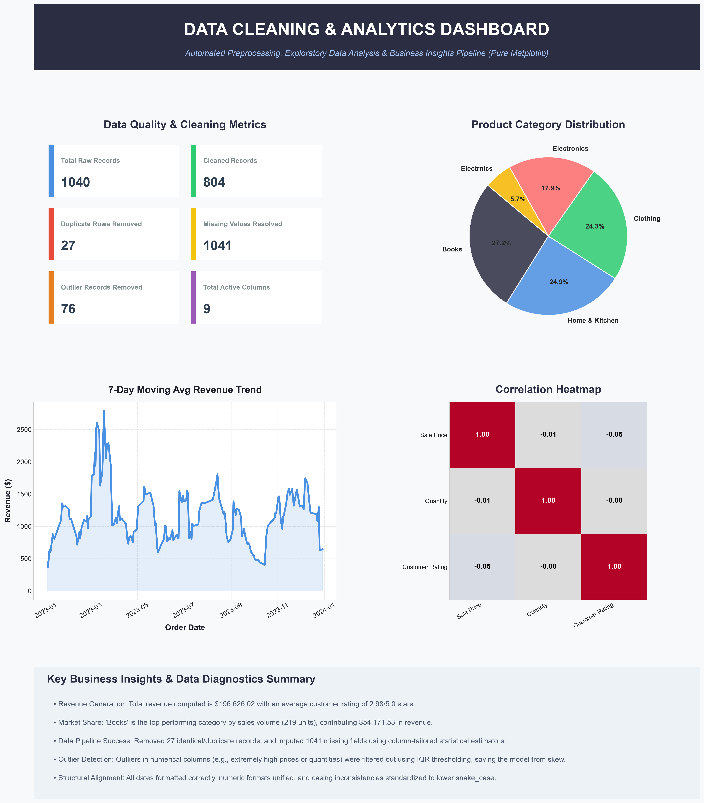
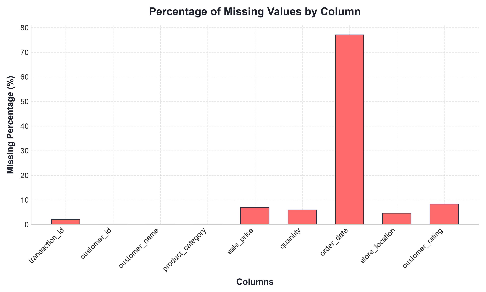
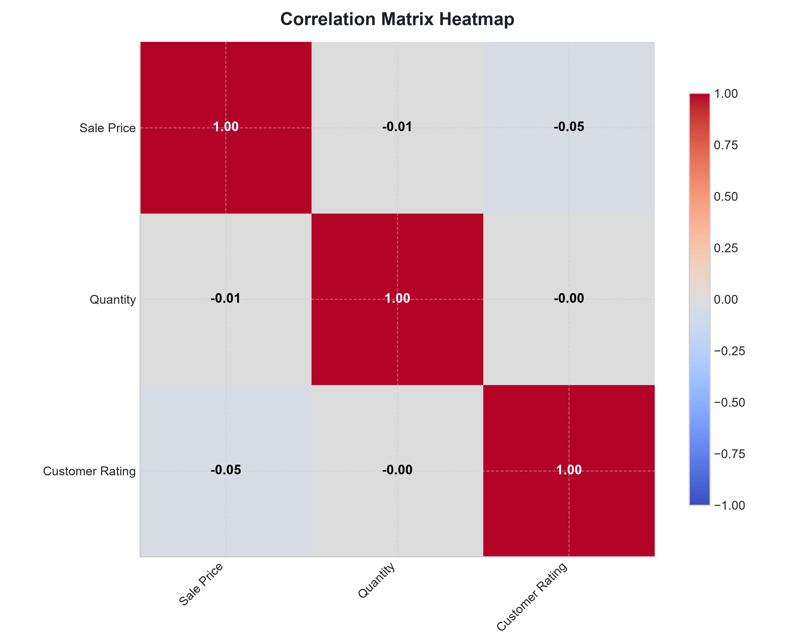

# Data Cleaning, Preprocessing & Visualization Pipeline

A professional, modular, and end-to-end Python pipeline built for data quality profiling, preprocessing, exploratory data analysis (EDA), and automated analytical reporting. This project is structured as an internship submission and a production-grade portfolio project.

---

## 🌟 Project Overview

Raw datasets collected from real-world systems are frequently laden with errors, missing entries, duplicated records, formatting inconsistencies, and extreme outliers. This application takes a messy, raw CSV file, applies a robust cleaning engine, generates high-quality exploratory visualizations, and compiles a final cleaned dataset along with a unified infographic dashboard and a detailed analytical report.

---

## 🚀 Key Features

*   **Data Profiling:** Inspects shapes, data types, memory footprints, and summary stats of raw datasets.
*   **Column Header Standardization:** Cleans headers to trim spaces, remove special characters, and convert to consistent `lower_snake_case`.
*   **Mismatched Type Parsing:** Unifies numeric values (handling currency symbols, commas, and keywords like `Free`) and parses messy date strings into standard ISO datetime formatting.
*   **Categorical Alignment:** Corrects casing and spelling inconsistencies in categorical variables (e.g. mapping `electrnics` or `  ELECTronics  ` to `Electronics`).
*   **Duplicate Detection:** Identifies and purges exact duplicate rows, keeping log audits of removed records.
*   **Missing Value Imputation:** Resolves missing entries using customizable columns-specific strategies:
    *   `mean` (e.g., customer ratings)
    *   `median` (e.g., sale prices)
    *   `mode` (e.g., product categories)
    *   `ffill` (e.g., temporal order dates)
    *   `constant` (e.g., filling names with 'Unknown Customer')
    *   `drop` (e.g., transaction ID identifiers)
*   **Outlier Treatment:** Employs the **Interquartile Range (IQR) Method** to isolate and prune extreme value skew (e.g. high test price inputs) and validates logical constraints (positive values, rating bounds).
*   **Exploratory Data Analysis (EDA):** Generates summary tables, correlation matrices, and transaction distributions.
*   **11-Chart Visual Toolkit:** Saves high-resolution analytical PNG plots (distribution, line trends, category shares, correlations, scatter plots, box plots, count frequencies, pair plots, and violin plots).
*   **Infographic Executive Dashboard:** Compiles a unified KPI and data visualization dashboard (`output/dashboard.png`) summarizing the pipeline.
*   **Automated Analytical Reporting:** Generates an audit trail and recommendations report (`output/summary_report.txt`).

---

## 🛠️ Technologies Used

*   **Core:** Python 3.14+
*   **Data Manipulation:** Pandas, NumPy
*   **Data Visualization:** Matplotlib, Seaborn
*   **Image Compilation:** Pillow
*   **Interactive Worksheets:** Jupyter Notebook

---

## 📂 Project Folder Structure

```
Data_Cleaning_Project/
│
├── data/
│   └── raw_dataset.csv          # Generated messy raw data (input)
│
├── output/
│   ├── cleaned_dataset.csv      # Standardized and processed dataset
│   ├── dashboard.png            # Infographic summarizing KPIs & insights
│   ├── summary_report.txt       # Text audit report & business recommendations
│   └── charts/                  # Folder containing 11 individual plots
│       ├── missing_values.png
│       ├── price_distribution.png
│       ├── sales_trend.png
│       ├── category_distribution.png
│       └── ...
│
├── notebooks/
│   └── data_cleaning.ipynb      # Interactive Jupyter notebook walkthrough
│
├── src/
│   ├── __init__.py
│   ├── generate_raw_data.py     # Messy mock data generator
│   ├── load_data.py             # Data loading and profiling engine
│   ├── cleaning.py              # Preprocessing & cleaning engine
│   ├── visualization.py         # Matplotlib rendering & dashboard compiler
│   ├── report.py                # Analytical report generator
│   └── main.py                  # Pipeline execution orchestrator
│
├── requirements.txt             # Project library dependencies
├── .gitignore                   # Files to exclude from Git
├── LICENSE                      # MIT Open Source License
└── README.md                    # Project documentation (this file)
```

---

## ⚙️ Installation & Running Guide

### Prerequisites
Make sure you have Python 3.x installed. 

### 1. Clone or Download the Project
Copy this project folder to your local machine.

### 2. Install Dependencies
Open your command prompt or terminal in the project root directory and run:
```bash
pip install -r requirements.txt
```

### 3. Execute the Pipeline
Run the main orchestrator script:
```bash
python src/main.py
```
This script will:
1. Generate the messy mock dataset in `data/raw_dataset.csv` (if not already present).
2. Clean the data, resolve duplicates, handle missing values, and treat outliers.
3. Save the clean data to `output/cleaned_dataset.csv`.
4. Render and save all 11 individual charts in `output/charts/`.
5. Compile and export the infographic dashboard to `output/dashboard.png`.
6. Export the summary report log to `output/summary_report.txt`.

### 4. Run the Jupyter Notebook
To run the interactive step-by-step walkthrough:
```bash
jupyter notebook notebooks/data_cleaning.ipynb
```

### 5. Automatically Upload to GitHub
If Git is not installed or configured, you can use our built-in, zero-dependency Python uploader to automatically create a GitHub repository and push all files:
```bash
python src/upload_to_github.py
```
This script will safely prompt you for your GitHub username and Personal Access Token (PAT) and upload files.

---

## 📊 Sample Visualizations & Dashboard

### 1. Infographic Executive Dashboard (`output/dashboard.png`)
Below is the compiled 20x24 inch infographic summarizing data profile metrics, KPI counts, revenue trends, and key business insights.



### 2. Missing Values Percentage (`output/charts/missing_values.png`)
Visualizes the percentage share of missing values across raw columns prior to pipeline imputation.



### 3. Correlation Matrix Heatmap (`output/charts/correlation_heatmap.png`)
Illustrates Pearson correlation coefficients between cleaned numeric attributes.



---

## 🔮 Future Improvements

1.  **GUI Integration:** Build a Streamlit or Gradio interface to let users upload raw CSVs, select cleaning strategies interactively, and download cleaned files.
2.  **Database Connectors:** Implement SQL database integrations (SQLite, PostgreSQL) to load data directly.
3.  **Machine Learning Profiling:** Integrate automated anomaly and fraud detection models on transaction entries.
4.  **Advanced Time Series Forecasting:** Integrate ARIMA/Prophet models to forecast sales trends based on the cleaned history.

---

## 🧑‍💻 Author Information

*   **Name:** Laksh
*   **Designation:** Data Science Intern
*   **GitHub:** [https://github.com/Laksh](https://github.com/Laksh)
*   **Workspace:** Internship submission project
